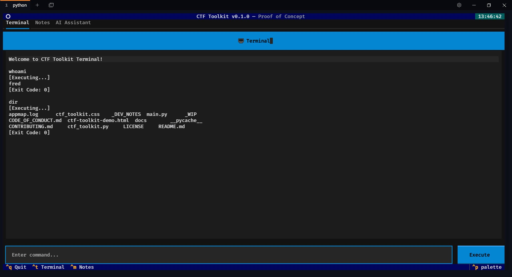
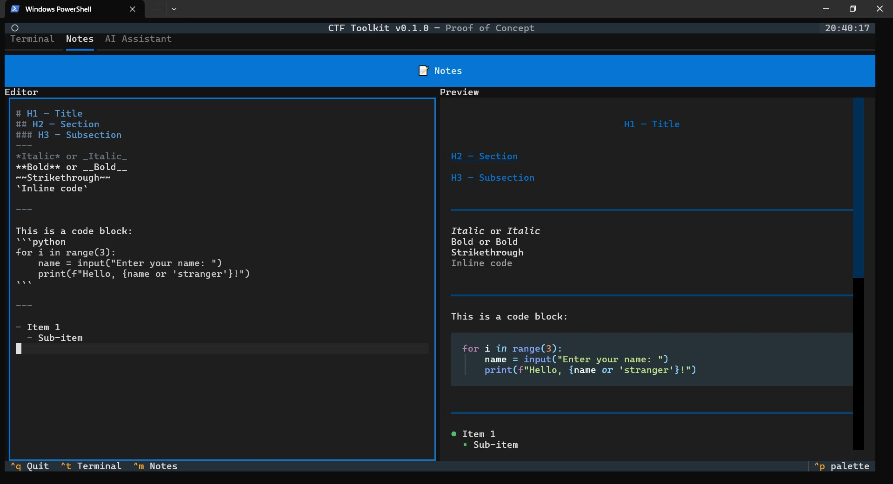
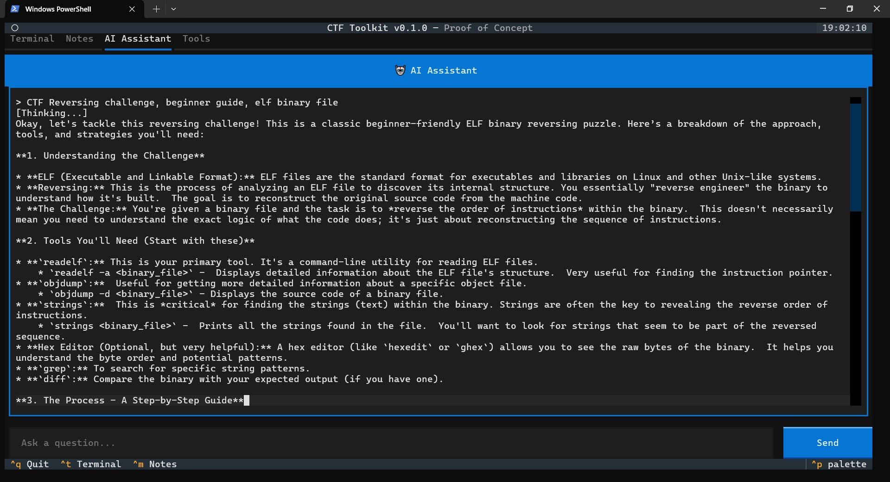

# CTF Toolkit

**A comprehensive Terminal User Interface (TUI) for streamlining Capture The Flag (CTF) competition workflows.**

The CTF Toolkit provides an integrated environment combining terminal operations, note-taking, AI assistance, and tool management in a single, efficient interface. Built with Python's Textual framework, it aims to enhance productivity for CTF players, security researchers, and penetration testers.

## Key Features
  
  
  
*   **Integrated Terminal:** Execute system commands directly within the application, with history and working directory management.
    
  
  
*   **Markdown Notes:** Take and manage notes using a live markdown editor with real-time preview.  
  
  
  
*   **AI Assistant:** Leverage AI for context-aware assistance during challenges, supporting various LLM providers (e.g., OpenAI, Ollama) via `litellm` and environment variable configuration.
*   **Keyboard-Driven Interface:** Navigate and operate the toolkit efficiently using keyboard shortcuts.

## Technology Stack

*   **Framework:** [Textual](https://textual.textualize.io/) (Python TUI framework)
*   **Language:** Python 3.7+
*   **Asynchronous Operations:** Utilizes `async/await` for non-blocking I/O.

## Getting Started

*(Detailed installation and setup instructions will be provided as the project matures beyond the Proof of Concept stage.)*

For now, to run the application, you would typically execute the main Python script:
```bash
python main.py
```
Before running, ensure you have a `.env` file configured for the AI Assistant, for example:
```

# Default LLM model (Free API key)
LITELLM_MODEL="gemini/gemini-2.0-flash"
GEMINI_API_KEY="your_gemini_api_key"

# Or use any provider/model supported by `litellm`:

# OPENAI_API_KEY="your_openai_api_key"
# OPENROUTER_API_KEY="your_openrouter_api_key"
# GROQ_API_KEY="your_groq_api_key"
# ...

```

## Usage - Key Bindings

| Shortcut | Action                       |
|----------|------------------------------|
| `Ctrl+Q` | Quit application             |
| `Ctrl+T` | Focus Terminal tab           |
| `Ctrl+M` | Focus Markdown/Notes tab     |
| `Ctrl+A` | Focus AI Assistant tab       |

## Development Status: Proof of Concept

This project is currently in the **Proof of Concept (PoC)** stage. Core functionalities are implemented to demonstrate the viability and potential of the toolkit.

**Current Implemented Features:**
*   Functional terminal command execution
*   Live markdown editing and preview
*   Keyboard navigation

**Roadmap / Production Readiness Requirements:**
*   Full integration with LLM APIs (OpenAI, Gemini, Groq, Anthropic, OpenRouter, Local Ollama)
*   Configuration file management for user settings and API keys
*   Persistent session data (notes, command history, AI conversations)
*   Enhanced error handling, logging, and stability
*   Performance optimization, especially for large terminal outputs
*   Cross-platform compatibility testing and improvements

## Core Components

The application is structured around a Manager-Component architecture:

*   **Managers (Business Logic):**
    *   `TerminalManager`: Handles command execution.
    *   `MarkdownManager`: Manages note-taking.
    *   `LLMManager`: Integrates AI assistance.
    *   `PluginManager`: Manages external tools.
*   **UI Components (Interface Layer):**
    *   `TerminalTab`: UI for terminal interaction.
    *   `MarkdownTab`: UI for note editing and preview.
    *   `AITab`: UI for AI assistant interaction.
    *   `PluginTab`: UI for tool management.
*   **Main Application (`CTFToolkitApp`):** Orchestrates the TUI.

## Dependencies

*   `textual>=0.40.0`
*   `python-dotenv`
*   `litellm`
*   Python 3.7+ (with built-in `asyncio`, `pathlib`, `subprocess`)

Future dependencies will include libraries for specific LLM providers (`openai`, `anthropic`), API calls (`requests`), and configuration (`pyyaml`).

## Contributing

We welcome contributions to the CTF Toolkit! As the project matures, detailed contribution guidelines will be provided. In the meantime, feel free to open issues for bug reports or feature requests, and submit pull requests with your improvements.

## License

This project is currently in its Proof of Concept stage, and a specific open-source license will be chosen and added as the project matures.

## Demo Files

Demo files, such as `ctf-toolkit-demo.html`, have been moved to the `demo/` directory. These files are for demonstration purposes only and are not part of the production AI Assistant code. All mock or simulated AI logic is now isolated from the main application to ensure that only real LLM integration remains in the main codebase.

## Documentation

- [AI Assistant LLM Workflow](docs/3-AI-Assistant/ai-assist-WORKFLOW.md): How the AI Assistant and LLM integration works.

---

This README provides an overview of the CTF Toolkit project. For more detailed architectural information, please refer to [`docs/ctf_toolkit_overview.md`](docs/ctf_toolkit_overview.md:1).
