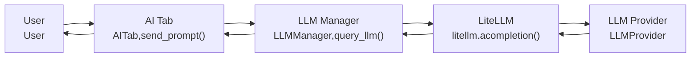

# Codebase Research Report

## Query
ai assistant workflow

## Answer
### System Diagram



### Summary
Okay, I have the AI assistant workflow steps and components. Now I will generate the Markdown report.

```markdown
# CodeViz [AI Assistant Workflow]

## Overview

This report describes the workflow of the AI assistant in the system. The information is extracted from the `ai-assist-WORKFLOW.md` file (file:docs/3-AI-Assistant/ai-assist-WORKFLOW.md).

## Key Components

-   **User:** Interacts with the AI assistant.
-   **AITab (UI):** The user interface tab for the AI assistant. Handles user input and displays responses.
-   **LLMManager:** Manages the interaction with the LLM, including building the message list and handling responses.
-   **LiteLLM:** A library used to interact with different LLM providers.
-   **LLMProvider:** The actual LLM service (e.g., OpenAI, Ollama).

## Workflow Steps

1.  **User Input:** The user types a prompt in the `AITab` and sends it.
2.  **UI Event Handling:**
    -   `AITab` captures the input.
    -   `AITab` calls `send_prompt()` which retrieves the input text and displays the user's prompt and a "[Thinking...]" message.
3.  **LLMManager Interaction:**
    -   `AITab` calls `LLMManager.query_llm()` with the user's prompt.
    -   `LLMManager` builds a message list for the LLM API and reads the model/provider from environment variables.
4.  **LLM API Call:**
    -   `LLMManager` uses `litellm.acompletion()` to send the request to the `LLMProvider`. The request is asynchronous.
5.  **Response Handling:**
    -   The `LLMProvider` returns a response (or error) to `LiteLLM`. `LiteLLM` returns the response to `LLMManager`.
    -   `LLMManager` extracts the reply or returns a warning if there's an error.
6.  **Displaying the Response:**
    -   The AI's response is appended to the output area in the `AITab`.
    -   The "[Thinking...]" message is replaced with the actual answer.
```

## Walkthrough Steps

### 1. AI Assistant Workflow Overview
The AI assistant workflow begins with the `User` interacting with the `AITab` in the user interface. The `AITab` is responsible for capturing user input and displaying responses from the AI assistant. The core components involved are the `User`, `AITab`, `LLMManager`, `LiteLLM`, and the `LLMProvider`.

### 2. User Input and UI Event Handling
The `User` types a prompt in the `AITab` and sends it. The `AITab` captures this input and then calls the `send_prompt()` function. This function retrieves the input text and displays both the user's prompt and a '[Thinking...]' message in the `AITab`.

### 3. Interaction with LLMManager
After capturing the user's prompt, the `AITab` interacts with the `LLMManager` by calling the `LLMManager.query_llm()` function, passing the user's prompt as an argument. The `LLMManager` then builds a message list formatted for the LLM API. It also reads the model and provider information from environment variables to configure the API call.

### 4. LLM API Call via LiteLLM
The `LLMManager` uses the `litellm.acompletion()` function to send an asynchronous request to the `LLMProvider`. `LiteLLM` acts as an abstraction layer, allowing the system to interact with various `LLMProvider` services such as OpenAI or Ollama.

### 5. Response Handling from LLMProvider
The `LLMProvider` processes the request and returns a response (or an error) to `LiteLLM`. `LiteLLM` then relays this response back to the `LLMManager`. The `LLMManager` extracts the AI's reply from the response. If an error occurred, it returns a warning message instead.

### 6. Displaying the AI Response
Finally, the AI's response is appended to the output area within the `AITab`, making it visible to the user. The '[Thinking...]' message is replaced with the actual answer, completing the workflow from user input to AI response.

## Detailed Sub-Search Results

### 1. Extract the AI assistant workflow steps and components from the ai-assist-WORKFLOW.md file.
The AI assistant workflow involves these steps and components:

- **Components:**
    - `User`: Interacts with the AI assistant.
    - `AITab` (UI): The user interface tab for the AI assistant. Handles user input and displays responses.
    - `LLMManager`: Manages the interaction with the LLM, including building the message list and handling responses.
    - `LiteLLM`: A library used to interact with different LLM providers.
    - `LLMProvider`: The actual LLM service (e.g., OpenAI, Ollama).

- **Workflow Steps:**
    1.  **User Input:** The user types a prompt in the `AITab` and sends it.
    2.  **UI Event Handling:**
        - `AITab` captures the input.
        - `AITab` calls `send_prompt()` which retrieves the input text and displays the user's prompt and a "[Thinking...]" message.
    3.  **LLMManager Interaction:**
        - `AITab` calls `LLMManager.query_llm()` with the user's prompt.
        - `LLMManager` builds a message list for the LLM API and reads the model/provider from environment variables.
    4.  **LLM API Call:**
        - `LLMManager` uses `litellm.acompletion()` to send the request to the `LLMProvider`. The request is asynchronous.
    5.  **Response Handling:**
        - The `LLMProvider` returns a response (or error) to `LiteLLM`. `LiteLLM` returns the response to `LLMManager`.
        - `LLMManager` extracts the reply or returns a warning if there's an error.
    6.  **Displaying the Response:**
        - The AI's response is appended to the output area in the `AITab`.
        - The "[Thinking...]" message is replaced with the actual answer.

---
*Generated by [CodeViz.ai](https://codeviz.ai) on 6/9/2025, 10:08:42 PM*
