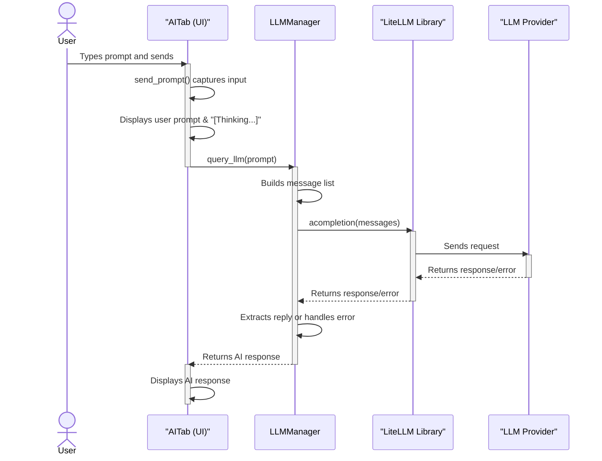

# AI Assistant LLM Workflow

## Diagram
  

  
---  
  
This document explains how the AI Assistant (LLM) workflow operates in the CTF Toolkit application.

---

## 1. User Interaction

- The user navigates to the **AI Assistant** tab in the TUI.
- The user types a question or prompt and presses **Send** (or Enter).

## 2. UI Event Handling

- The UI component (`AITab`) captures the input.
- It triggers `send_prompt()`, which:
  - Retrieves the input text.
  - Displays the user's prompt and a "[Thinking...]" message in the output area.

## 3. LLMManager: Business Logic

- `AITab` calls `LLMManager.query_llm()` with the user's prompt (and optional context).
- `LLMManager`:
  - Builds a message list for the LLM API.
  - Reads the model/provider from environment variables (e.g., `LITELLM_MODEL`).

## 4. Calling the LLM API

- `LLMManager` uses the `litellm` library's `acompletion()` to send the request to the LLM provider (OpenAI, Ollama, etc.).
- The request is asynchronous.

## 5. Receiving and Handling the Response

- The LLM provider returns a response (or error).
- `LLMManager` extracts the reply or returns a warning if there's an error.

## 6. Displaying the AI Response

- The AI's response is appended to the output area in the AI Assistant tab.
- The "[Thinking...]" message is replaced with the actual answer.

---

## Workflow Diagram

```
User Input (AI Tab)
      │
      ▼
send_prompt() in AITab
      │
      ▼
LLMManager.query_llm(prompt)
      │
      ▼
litellm.acompletion() → LLM Provider (OpenAI, Ollama, etc.)
      │
      ▼
LLM Response (or error)
      │
      ▼
Display AI Response in UI
```

---

## Key Points

- **No mock/demo code**: All responses come from real LLMs via the configured provider.
- **Configurable**: LLM provider/model set via environment variables.
- **Async**: Workflow is asynchronous for smooth UX.
- **Separation of Concerns**: UI handles display/input; `LLMManager` handles LLM communication.
