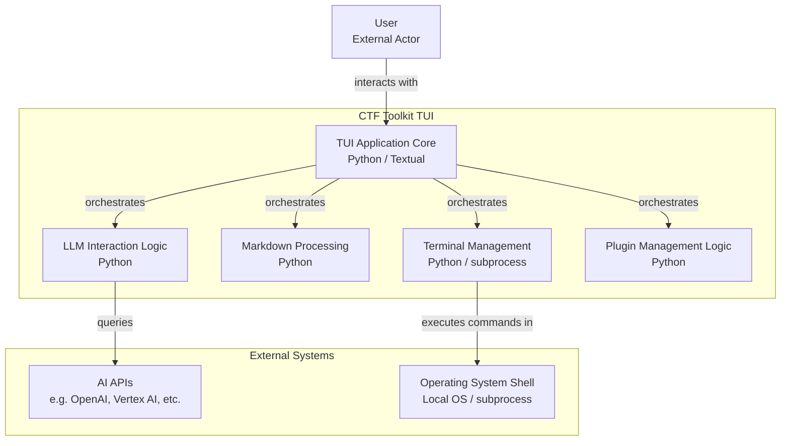
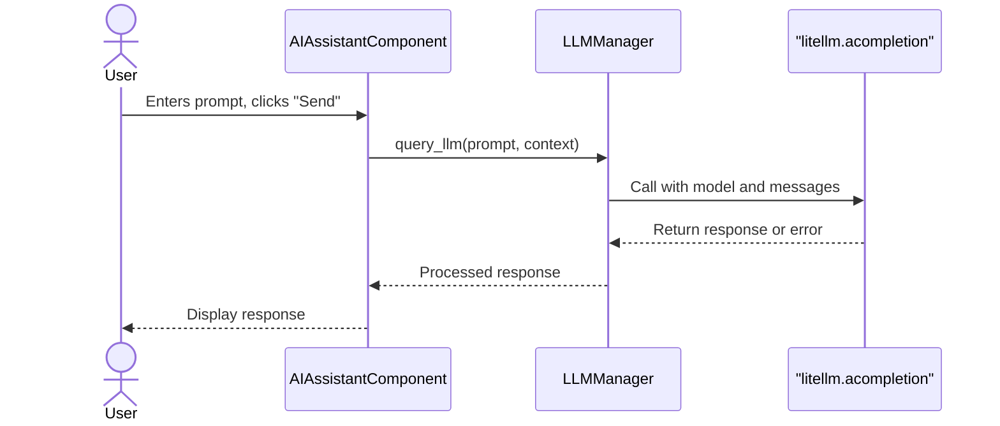
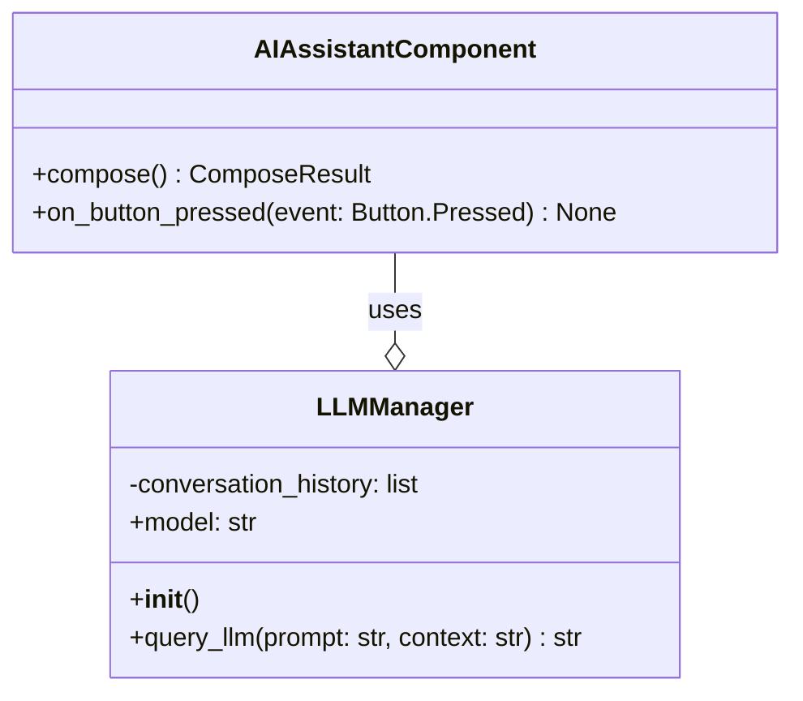
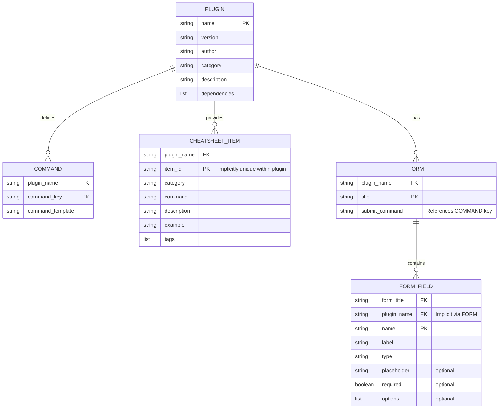
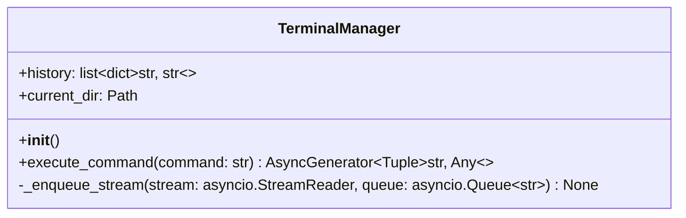
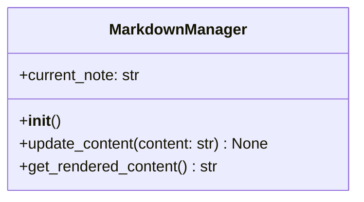
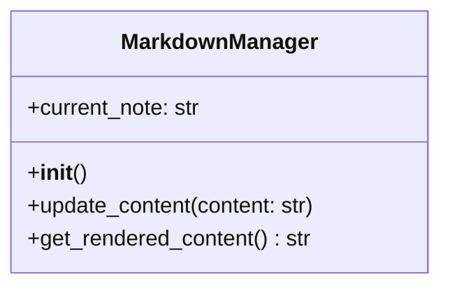
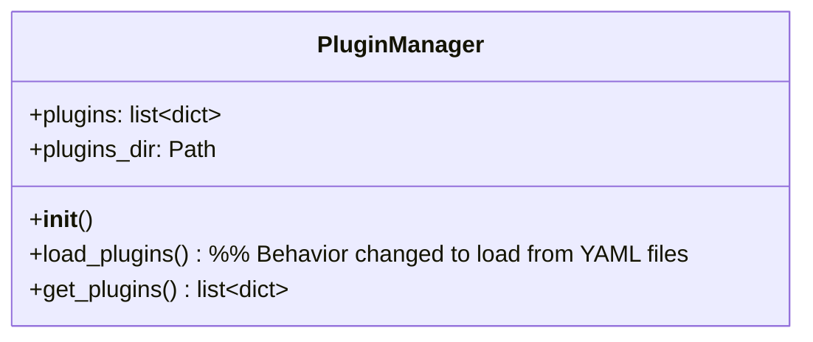

# v0.3.0 - Diagram 

## Overview

---

## Sequence Diagram for AI Query with LiteLLM

---

## Class Diagram for Updated LLMManager and AIAssistantComponent

---

## Entity Relationship diagram for Plugin YAML structure

---

## Class Diagram for TerminalManager

---

## Class Diagram for MarkdownManager

---

---

## Class Diagram for PluginManager

