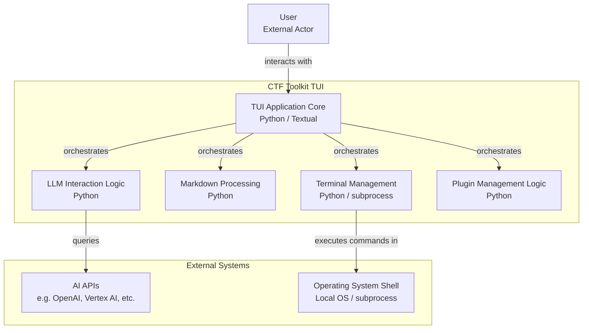
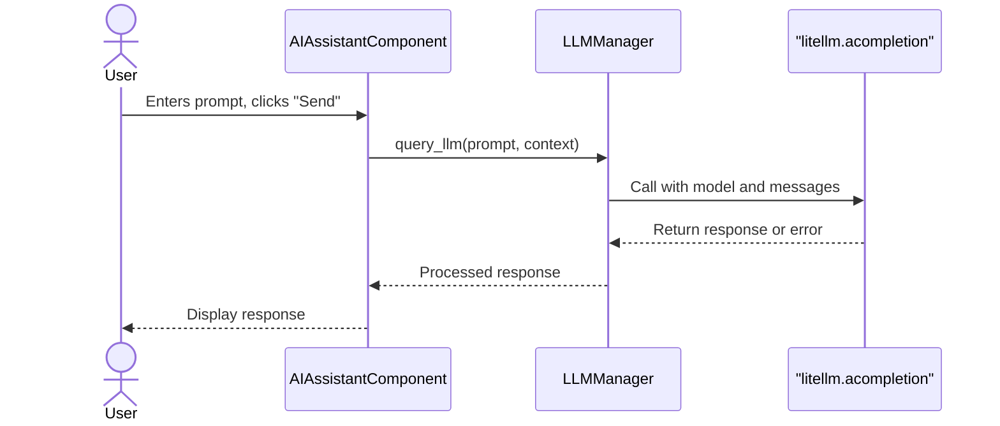
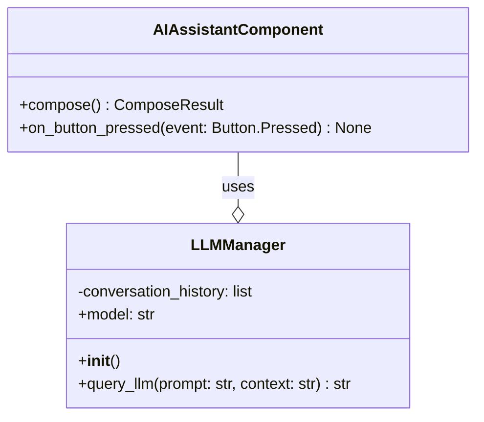

# v0.3.0 - Diagram 

## Overview

```mermaid
graph TD

    189["User<br>External Actor"]
    subgraph 180["External Systems"]
        187["AI APIs<br>e.g. OpenAI, Vertex AI, etc."]
        188["Operating System Shell<br>Local OS / subprocess"]
    end
    subgraph 181["CTF Toolkit TUI<br>Python / Textual"]
        182["TUI Application Core<br>Python / Textual"]
        183["Terminal Management<br>Python / subprocess"]
        184["Markdown Processing<br>Python"]
        185["LLM Interaction Logic<br>Python"]
        186["Plugin Management Logic<br>Python"]
        %% Edges at this level (grouped by source)
        182["TUI Application Core<br>Python / Textual"] -->|orchestrates| 183["Terminal Management<br>Python / subprocess"]
        182["TUI Application Core<br>Python / Textual"] -->|orchestrates| 184["Markdown Processing<br>Python"]
        182["TUI Application Core<br>Python / Textual"] -->|orchestrates| 185["LLM Interaction Logic<br>Python"]
        182["TUI Application Core<br>Python / Textual"] -->|orchestrates| 186["Plugin Management Logic<br>Python"]
    end
    %% Edges at this level (grouped by source)
    189["User<br>External Actor"] -->|interacts with| 182["TUI Application Core<br>Python / Textual"]
    185["LLM Interaction Logic<br>Python"] -->|queries| 187["AI APIs<br>e.g. OpenAI, Vertex AI, etc."]
    183["Terminal Management<br>Python / subprocess"] -->|executes commands in| 188["Operating System Shell<br>Local OS / subprocess"]
```

---

## Sequence Diagram for AI Query with LiteLLM

```mermaid
sequenceDiagram
    actor User
    participant AIAssistantComponent
    participant LLMManager
    participant LiteLLM as "litellm.acompletion"

    User->>AIAssistantComponent: Enters prompt, clicks "Send"
    AIAssistantComponent->>LLMManager: query_llm(prompt, context)
    LLMManager->>LiteLLM: Call with model and messages
    LiteLLM-->>LLMManager: Return response or error
    LLMManager-->>AIAssistantComponent: Processed response
    AIAssistantComponent-->>User: Display response
```

---

## Class Diagram for Updated LLMManager and AIAssistantComponent

```mermaid
classDiagram
    class LLMManager {
        -conversation_history: list
        +model: str
        +__init__()
        +query_llm(prompt: str, context: str) str
    }
    class AIAssistantComponent {
        +compose() ComposeResult
        +on_button_pressed(event: Button.Pressed) None
    }
    AIAssistantComponent --o LLMManager : uses
```
