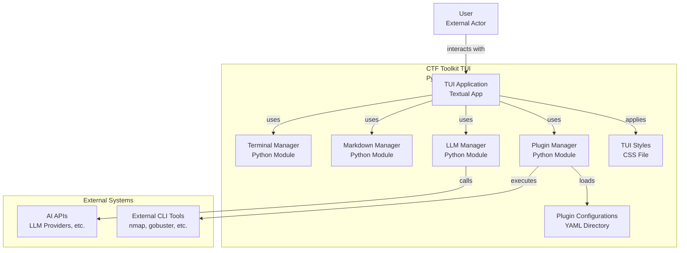
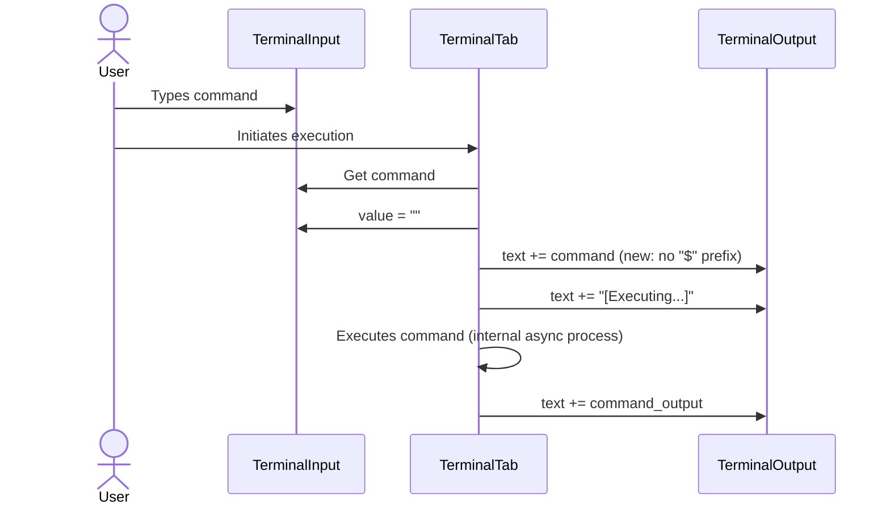

# v0.3.2 - CTF-Toolkit - Diagrams

## Overview

```mermaid  
graph TD  
    
    393["User<br>External Actor"]
    subgraph 391["External Systems"]
        401["AI APIs<br>LLM Providers, etc."]
        402["External CLI Tools<br>nmap, gobuster, etc."]
    end
    subgraph 392["CTF Toolkit TUI<br>Python / Textual"]
        394["TUI Application<br>Textual App"]
        395["Terminal Manager<br>Python Module"]
        396["Markdown Manager<br>Python Module"]
        397["LLM Manager<br>Python Module"]
        398["Plugin Manager<br>Python Module"]
        399["Plugin Configurations<br>YAML Directory"]
        400["TUI Styles<br>CSS File"]
        %% Edges at this level (grouped by source)
        394["TUI Application<br>Textual App"] -->|uses| 395["Terminal Manager<br>Python Module"]
        394["TUI Application<br>Textual App"] -->|uses| 396["Markdown Manager<br>Python Module"]
        394["TUI Application<br>Textual App"] -->|uses| 397["LLM Manager<br>Python Module"]
        394["TUI Application<br>Textual App"] -->|uses| 398["Plugin Manager<br>Python Module"]
        394["TUI Application<br>Textual App"] -->|applies| 400["TUI Styles<br>CSS File"]
        398["Plugin Manager<br>Python Module"] -->|loads| 399["Plugin Configurations<br>YAML Directory"]
    end
    %% Edges at this level (grouped by source)
    393["User<br>External Actor"] -->|interacts with| 394["TUI Application<br>Textual App"]
    398["Plugin Manager<br>Python Module"] -->|executes| 402["External CLI Tools<br>nmap, gobuster, etc."]
    397["LLM Manager<br>Python Module"] -->|calls| 401["AI APIs<br>LLM Providers, etc."]
```

---

## Terminal Command Execution Flow

```mermaid  
sequenceDiagram  
    actor User  
    participant TerminalInput  
    participant TerminalTab  
    participant TerminalOutput  
  
    User->>TerminalInput: Types command  
    User->>TerminalTab: Initiates execution  
    TerminalTab->>TerminalInput: Get command  
    TerminalTab->>TerminalInput: value = ""  
    TerminalTab->>TerminalOutput: text += command (new: no "$" prefix)  
    TerminalTab->>TerminalOutput: text += "[Executing...]"  
    TerminalTab->>TerminalTab: Executes command (internal async process)  
    TerminalTab->>TerminalOutput: text += command_output  
```  
